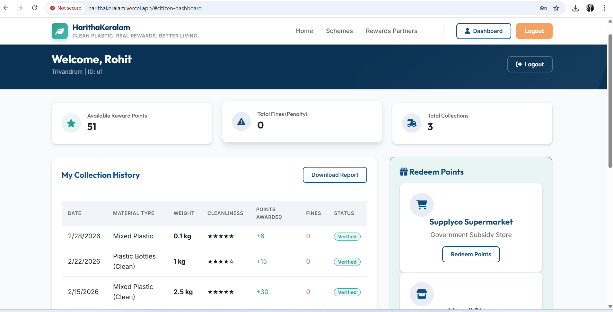
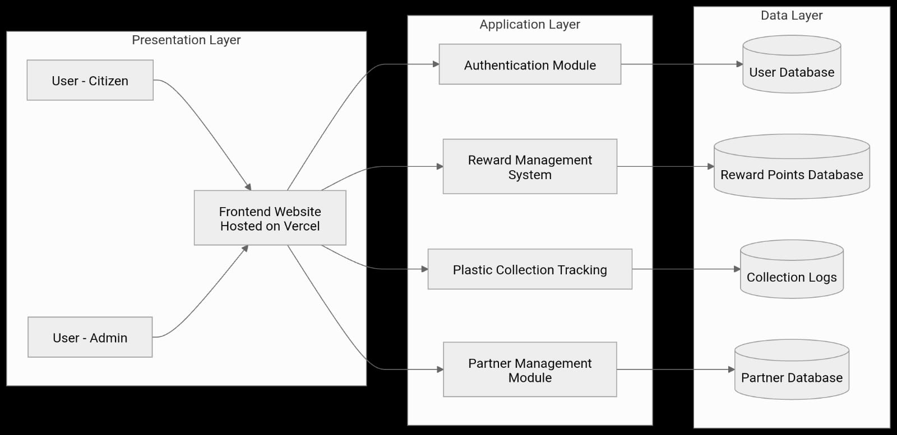

<p align="center">
  
</p>

# HARITHAKERALAM

## Basic Details

### Team Name: Aurora

### Team Members
- Sandra N - College of Engineering Thalassery

### Hosted Project Link
harithakeralam.vercel.app

### Project Description
A revolutionary project incentivising responsible waste disposal through credit points, redeemable for community benefits, fostering a cleaner environment and stronger community engagement. Harithakeralam is a platform that works in collaboration with plastic collection groups such as Haritha Karma Sena to promote responsible plastic waste disposal through a digital points-based system. 

### The Problem statement
Urban waste management systems are overwhelmed by increasing waste, causing environmental pollution and health hazards, while communities lack awareness and collective action, leading to improper disposal that contaminates soil, water, and air, degrading ecosystems and human well‑being.

### The Solution
This project Harithakeralam aims to revolutionize plastic waste management by incentivizing responsible waste disposal through a credit-based system. This platform encourages individuals to segregate and recycle plastic waste, rewarding them with redeemable community benefits and credit points. Citizens are awarded positive points for providing clean and dry plastic waste, while negative points are assigned for untidy or improperly handled waste. This system encourages behavioral change, improves recycling efficiency, supports waste collectors, and strengthens sustainable plastic waste management. This website provides a personalized dashboard for citizens to view their waste collection and rewards progress and an admin login for the heads of waste collecting organizations to add new entries and update their activities.

## Technical Details

### Technologies/Components Used

**For Software:**
- Languages used: JavaScript, HTML, CSS
- Frameworks used: none
- Libraries used: UX4G Design, Google Fonts
- Tools used: Github, VS Code

## Features

List the key features of your project:
- Feature 1: Reward points which are redeemable through Govt Stores
- Feature 2: Community Engagement
- Feature 3: Strengthens sustainable plastic waste management
- Feature 4: Improves recycling efficiency

## Implementation


### For Software:

#### Installation
```bash
npm install
```

#### Run
```bash
npm start
```
## Project Documentation

### For Software:

#### Screenshots (Add at least 3)


*This shows the admin page section*


*This shows the admin page 2nd section*


*This shows the home page*


this shows the login page


this shows the user dashboard

#### Diagrams

**System Architecture:**




## Project Demo

### Video
https://drive.google.com/drive/folders/192verKO8IRl048JbpWO2twhQt3UYM-vK?usp=sharing

This video demonstrates the flow of the website
---

## AI Tools Used

If you used AI tools during development, document them here for transparency:

**Tool Used:** Gemini, Antigravity

**Purpose:** 
Gemini for structuring content
Antigravity helped for website creation

## License

MIT License

Copyright (c) 2026 HarithaKeralam Project

Permission is hereby granted, free of charge, to any person obtaining a copy
of this software and associated documentation files (the "Software"), to deal
in the Software without restriction, including without limitation the rights
to use, copy, modify, merge, publish, distribute, sublicense, and/or sell
copies of the Software, and to permit persons to whom the Software is
furnished to do so, subject to the following conditions:

The above copyright notice and this permission notice shall be included in all
copies or substantial portions of the Software.

THE SOFTWARE IS PROVIDED "AS IS", WITHOUT WARRANTY OF ANY KIND, EXPRESS OR
IMPLIED, INCLUDING BUT NOT LIMITED TO THE WARRANTIES OF MERCHANTABILITY,
FITNESS FOR A PARTICULAR PURPOSE AND NONINFRINGEMENT. IN NO EVENT SHALL THE
AUTHORS OR COPYRIGHT HOLDERS BE LIABLE FOR ANY CLAIM, DAMAGES OR OTHER
LIABILITY, WHETHER IN AN ACTION OF CONTRACT, TORT OR OTHERWISE, ARISING FROM,
OUT OF OR IN CONNECTION WITH THE SOFTWARE OR THE USE OR OTHER DEALINGS IN THE
SOFTWARE.


Made with ❤️ at TinkerHub
