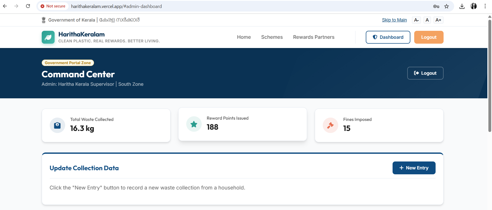
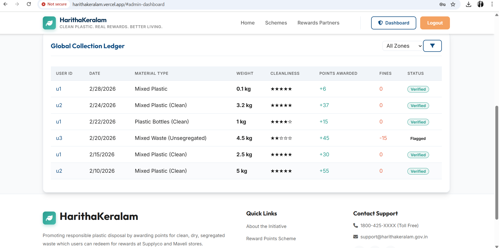
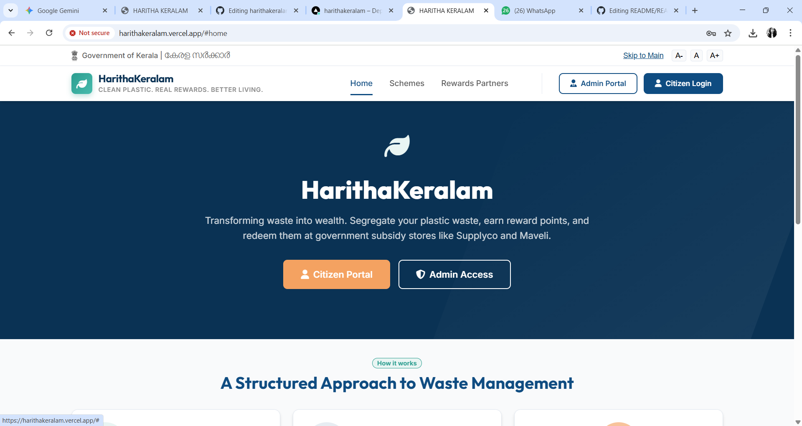
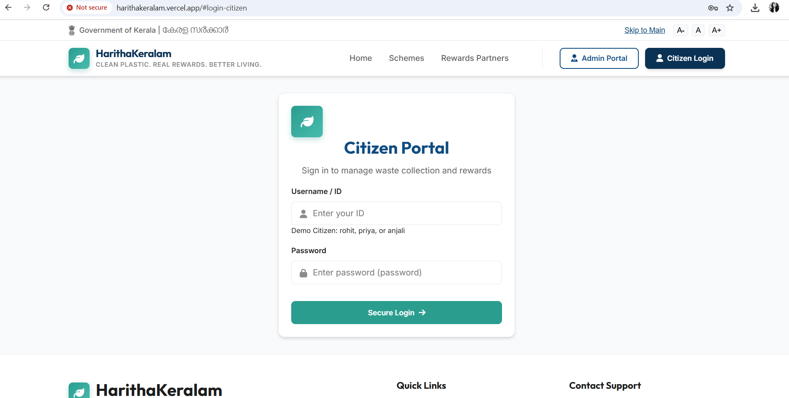

<p align="center">
  
</p>

# HARITHAKERALAM

## Basic Details

### Team Name: Aurora

### Team Members
- Member 1: Sandra N - College of Engineering Thalassery

### Hosted Project Link
harithakeralam.vercel.app

### Project Description
A revolutionary project incentivising responsible waste disposal through credit points, redeemable for community benefits, fostering a cleaner environment and stronger community engagement. Harithakeralam is a platform that works in collaboration with plastic collection groups such as Haritha Karma Sena to promote responsible plastic waste disposal through a digital points-based system. 

### The Problem statement
Urban waste management systems are overwhelmed by increasing waste, causing environmental pollution and health hazards, while communities lack awareness and collective action, leading to improper disposal that contaminates soil, water, and air, degrading ecosystems and human well‑being.

### The Solution
This project Harithakeralam aims to revolutionize plastic waste management by incentivizing responsible waste disposal through a credit-based system. This platform encourages individuals to segregate and recycle plastic waste, rewarding them with redeemable community benefits and credit points. Citizens are awarded positive points for providing clean and dry plastic waste, while negative points are assigned for untidy or improperly handled waste. This system encourages behavioral change, improves recycling efficiency, supports waste collectors, and strengthens sustainable plastic waste management. This website provides a personalized dashboard for citizens to view their waste collection and rewards progress and an admin login for the heads of waste collecting organizations to add new entries and update their activities.

## Technical Details

### Technologies/Components Used

**For Software:**
- Languages used: JavaScript, HTML, CSS
- Frameworks used: none
- Libraries used: UX4G Design, Google Fonts
- Tools used: Github, VS Code

## Features

List the key features of your project:
- Feature 1: Reward points which are redeemable through Govt Stores
- Feature 2: Community Engagement
- Feature 3: Strengthens sustainable plastic waste management
- Feature 4: Improves recycling efficiency

## Implementation


### For Software:

#### Installation
```bash
npm install
```

#### Run
```bash
npm start
```
## Project Documentation

### For Software:

#### Screenshots (Add at least 3)


*This shows the admin page section*


*This shows the admin page 2nd section*


*This shows the home page*


this shows the login page


#### Diagrams

**System Architecture:**


*Explain your system architecture - components, data flow, tech stack interaction*

**Application Workflow:**


*Add caption explaining your workflow*


#### Build Photos


*List out all components shown*


*Explain the build steps*


*Explain the final build*

---

## Additional Documentation

### For Web Projects with Backend:

#### API Documentation

**Base URL:** `https://api.yourproject.com`

##### Endpoints

**GET /api/endpoint**
- **Description:** [What it does]
- **Parameters:**
  - `param1` (string): [Description]
  - `param2` (integer): [Description]
- **Response:**
```json
{
  "status": "success",
  "data": {}
}
```

**POST /api/endpoint**
- **Description:** [What it does]
- **Request Body:**
```json
{
  "field1": "value1",
  "field2": "value2"
}
```
- **Response:**
```json
{
  "status": "success",
  "message": "Operation completed"
}
```

[Add more endpoints as needed...]

---


## Project Demo

### Video
[Add your demo video link here - YouTube, Google Drive, etc.]

*Explain what the video demonstrates - key features, user flow, technical highlights*

### Additional Demos
[Add any extra demo materials/links - Live site, APK download, online demo, etc.]

---

## AI Tools Used (Optional - For Transparency Bonus)

If you used AI tools during development, document them here for transparency:

**Tool Used:** [e.g., GitHub Copilot, v0.dev, Cursor, ChatGPT, Claude]

**Purpose:** [What you used it for]
- Example: "Generated boilerplate React components"
- Example: "Debugging assistance for async functions"
- Example: "Code review and optimization suggestions"

**Key Prompts Used:**
- "Create a REST API endpoint for user authentication"
- "Debug this async function that's causing race conditions"
- "Optimize this database query for better performance"

**Percentage of AI-generated code:** [Approximately X%]

**Human Contributions:**
- Architecture design and planning
- Custom business logic implementation
- Integration and testing
- UI/UX design decisions

*Note: Proper documentation of AI usage demonstrates transparency and earns bonus points in evaluation!*

---

## Team Contributions

- [Name 1]: [Specific contributions - e.g., Frontend development, API integration, etc.]
- [Name 2]: [Specific contributions - e.g., Backend development, Database design, etc.]
- [Name 3]: [Specific contributions - e.g., UI/UX design, Testing, Documentation, etc.]

---

## License

This project is licensed under the [LICENSE_NAME] License - see the [LICENSE](LICENSE) file for details.

**Common License Options:**
- MIT License (Permissive, widely used)
- Apache 2.0 (Permissive with patent grant)
- GPL v3 (Copyleft, requires derivative works to be open source)

---

Made with ❤️ at TinkerHub
